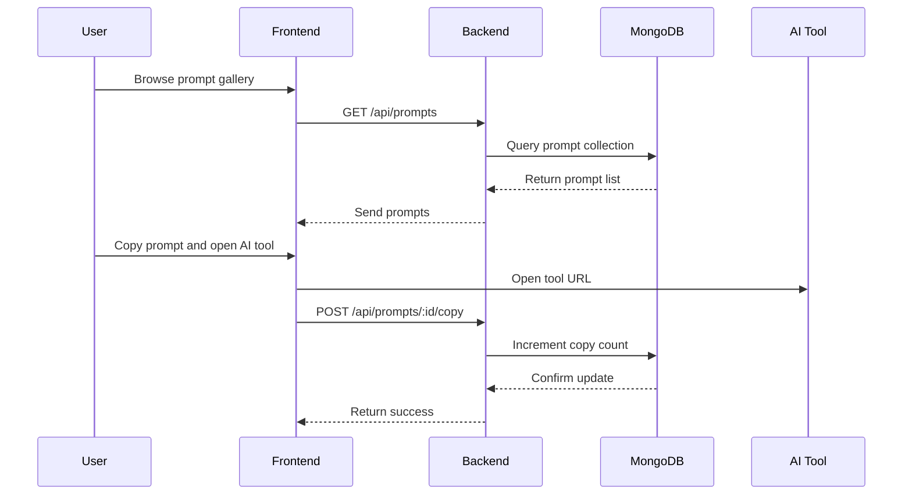

# Prompt Lab System Design

## Overview

Prompt Lab is a full-stack web application that helps users discover, upload, and test AI prompts. The system is designed to support global prompt delivery, authenticated user accounts, and AI tool integration for prompt copy-and-paste workflows.

Key goals:
- Provide prompt galleries for AI workflows.
- Let registered users upload and manage prompts.
- Support prompt workflows for photo editing, document rewriting, audio cleanup, and code review.
- Allow users to compare the best AI tool versions for prompt execution.

## High-level architecture

Frontend:
- React + Vite + Tailwind + Ant Design
- Pages for Home, Prompt Gallery, User Dashboard, Admin Dashboard, Login, Register, Verify, Upload Prompt
- Uses Axios to call backend APIs
- Stores authentication tokens in local storage and includes `Bearer` tokens on requests

Backend:
- Node.js + Express
- MongoDB via Mongoose for persistent prompt and user storage
- Routes for prompts, users, auth, and admin functionality
- Email verification is handled via a verification token stored on the user record

Database:
- `users` collection stores account details, verification state, and roles
- `prompts` collection stores prompt text, category, description, copy count, and creator metadata
- `media` collection stores prompt images, AI result images, and upload metadata

## System flow

1. User arrives on the website and can browse public prompts.
2. To contribute prompts, the user registers and verifies their email.
3. After login, the user can upload new prompt text and attach it to their account.
4. The app stores prompt content in MongoDB and makes it available via `/api/prompts`.
5. When a user opens a prompt, they can copy it and launch an AI tool from the prompt gallery.
6. Copy events are counted so admins can track prompt popularity.

## Flow diagram

```mermaid
flowchart LR
  Visitor[Visitor] --> Home[Home Page]
  Home --> Gallery[Prompt Gallery]
  Gallery --> Copy[Copy Prompt]
  Copy --> Tool[AI Tool Window]
  Visitor --> Auth[Register / Login]
  Auth --> Verify[Verify Email]
  Verify --> Active[Account Active]
  Active --> Upload[Upload Prompt]
  Upload --> API[/api/prompts/upload-text]
  API --> DB[(MongoDB Prompt Collection)]
  Gallery --> API2[/api/prompts]
```

## Sequence diagram



## User account and prompt upload flow

- **Register**: User creates an account with name, email, and password.
- **Email verification**: A token is returned and can be entered on the verify page.
- **Login**: After verification, the user logs in and receives a JWT token.
- **Upload prompt**: Authenticated users submit prompt text, category, and description.
- **Prompt ownership**: Each prompt is stored with `createdBy` and `createdByName`.

## Global prompt distribution

Prompt Lab is built to serve prompts globally by:
- Exposing a central `/api/prompts` endpoint
- Delivering prompt content via a React gallery interface
- Providing quick copy-and-open access for multiple AI tools
- Letting admins upload prompt metadata, images, and SEO tags

## AI tool integration and photo editing prompts

Photo editing prompts are a critical use case:
- Users can select or upload prompts specifically for image editing.
- The system supports current source images and AI result image uploads.
- Users can compare prompt versions and see which AI tool performs best.
- The prompt gallery includes buttons to open popular AI tools and paste selected prompt text.

## AI tool version comparison

The website can help users choose the best AI tool version by tracking:
- prompt popularity
- prompt copy counts
- tool compatibility for image-editing prompts
- recommended tool versions in the UI or admin reports

### AI tool guidance table

| AI Tool | Best for | Version notes |
|--------|----------|---------------|
| Tool A | Photo editing | Best with latest image prompt formats |
| Tool B | Document rewrite | Strong at plain-language summaries |
| Tool C | Audio cleanup | Recommended for transcription prompts |
| Tool D | Image generation | Good for product mockups and UI visuals |

## AI tool version tracking architecture

- Each prompt record can include metadata for supported AI tool versions and compatibility tags.
- Prompt copy events are captured by `/api/prompts/:id/copy`, allowing the system to rank tool performance by usage.
- Admin and dashboard views can present top-performing tools for photo editing and other prompt types.
- The app can show a tool version score based on recent prompt copy actions, prompt category, and user feedback.
- This enables a “best version” recommendation next to AI tool buttons in the prompt gallery.

## Photo-edit prompt flow

- Photo-editing prompts are stored with fields for `category`, `description`, `createdBy`, and `createdByName`.
- Users can upload prompt text and attach a source image URL or AI result image metadata.
- The backend can extend `/api/prompts/media/:promptId` to return current images and AI-generated outputs for the prompt.
- The frontend gallery can highlight photo-edit prompts and display the best tools for image editing.
- A dedicated comparison section can help users test prompt variations against the latest AI tool versions.

## How it works

- Users browse prompts in the gallery.
- Each prompt can be copied with one click.
- AI tool buttons open the provider site in a new tab.
- The prompt text is copied to the clipboard automatically.
- The backend increments a prompt copy counter to measure prompt success.

## Recommended improvements

- Add a prompt version history page for reviewing prompt edits.
- Add a comparison dashboard for AI tool versions and AI model support.
- Add analytics for prompt copy rate and tool conversion.
